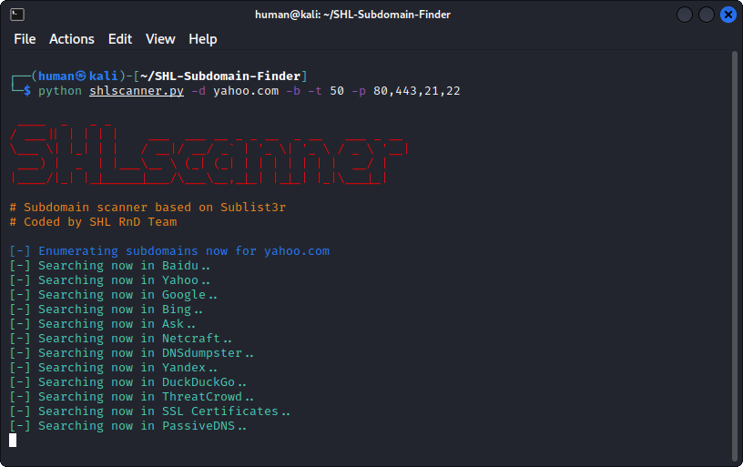

## About SHLscanner 

SHLscanner is a python tool based on [Sublist3r](https://github.com/aboul3la/Sublist3r) designed to enumerate subdomains of websites using OSINT. It helps penetration testers and bug hunters collect and gather subdomains for the domain they are targeting. SHLscanner enumerates subdomains using many search engines and many API endpoint for better results.

[subbrute](https://github.com/TheRook/subbrute) was integrated with SHLscanner to increase the possibility of finding more subdomains using bruteforce with an improved wordlist. The credit goes to TheRook who is the author of subbrute.

## Screenshots




## Installation

```
git clone https://github.com/darkcyber/SHL-Subdomain-Finder.git
```

## Recommended Python Version:

SHLscanner currently supports **Python 2** and **Python 3**.

* The recommended version for Python 2 is **2.7.x**
* The recommended version for Python 3 is **3.4.x**

## Dependencies:

SHLscanner depends on the `requests`, `dnspython` and `argparse` python modules.

These dependencies can be installed using the requirements file:

- Installation on Windows:
```
c:\python27\python.exe -m pip install -r requirements.txt
```
- Installation on Linux
```
sudo pip install -r requirements.txt
```

Alternatively, each module can be installed independently as shown below.

#### Requests Module (http://docs.python-requests.org/en/latest/)

- Install for Windows:
```
c:\python27\python.exe -m pip install requests
```

- Install for Ubuntu/Debian:
```
sudo apt-get install python-requests
```

- Install for Centos/Redhat:
```
sudo yum install python-requests
```

- Install using pip on Linux:
```
sudo pip install requests
```

#### dnspython Module (http://www.dnspython.org/)

- Install for Windows:
```
c:\python27\python.exe -m pip install dnspython
```

- Install for Ubuntu/Debian:
```
sudo apt-get install python-dnspython
```

- Install using pip:
```
sudo pip install dnspython
```

#### argparse Module

- Install for Ubuntu/Debian:
```
sudo apt-get install python-argparse
```

- Install for Centos/Redhat:
```
sudo yum install python-argparse
``` 

- Install using pip:
```
sudo pip install argparse
```

**for coloring in windows install the following libraries**
```
c:\python27\python.exe -m pip install win_unicode_console colorama
```

## Usage

Short Form    | Long Form     | Description
------------- | ------------- |-------------
-d            | --domain      | Domain name to enumerate subdomains of
-b            | --bruteforce  | Enable the subbrute bruteforce module
-p            | --ports       | Scan the found subdomains against specific tcp ports
-v            | --verbose     | Enable the verbose mode and display results in realtime
-t            | --threads     | Number of threads to use for subbrute bruteforce
-e            | --engines     | Specify a comma-separated list of search engines
-o            | --output      | Save the results to text file
-h            | --help        | show the help message and exit

### Examples

* To list all the basic options and switches use -h switch:

```python shlscanner.py -h```

* To enumerate subdomains of specific domain:

``python shlscanner.py -d example.com``

* To enumerate subdomains of specific domain and show only subdomains which have open ports 80 and 443 :

``python shlscanner.py -d example.com -p 80,443``

* To enumerate subdomains of specific domain and show the results in realtime:

``python shlscanner.py -v -d example.com``

* To enumerate subdomains and enable the bruteforce module:

``python shlscanner.py -b -d example.com``

* To enumerate subdomains and use specific engines such Google, Yahoo and Virustotal engines

``python shlscanner.py -e google,yahoo,virustotal -d example.com``


## Using SHLscanner as a module in your python scripts

**Example**

```python
import shlscanner 
subdomains = shlscanner.main(domain, no_threads, savefile, ports, silent, verbose, enable_bruteforce, engines)
```
The main function will return a set of unique subdomains found by SHLscanner

**Function Usage:**
* **domain**: The domain you want to enumerate subdomains of.
* **savefile**: save the output into text file.
* **ports**: specify a comma-sperated list of the tcp ports to scan.
* **silent**: set shlscanner to work in silent mode during the execution (helpful when you don't need a lot of noise).
* **verbose**: display the found subdomains in real time.
* **enable_bruteforce**: enable the bruteforce module.
* **engines**: (Optional) to choose specific engines.

Example to enumerate subdomains of Yahoo.com:
```python
import shlscanner 
subdomains = shlscanner.main('yahoo.com', 40, 'yahoo_subdomains.txt', ports= None, silent=False, verbose= False, enable_bruteforce= False, engines=None)
```

## License

SHLscanner is licensed under the GNU GPL license. take a look at the [LICENSE](https://github.com/darkcyber/SHL-Subdomain-Finder/blob/master/LICENSE) for more information.


## Credits

* [Ahmed Aboul-Ela](https://github.com/aboul3la) - The heart of this tool **shlscanner**. 
* [TheRook](https://github.com/TheRook) - The bruteforce module was based on his script **subbrute**. 
* [Bitquark](https://github.com/bitquark) - The Subbrute's wordlist was based on his research **dnspop**. 

## Thanks

* Special Thanks to [Ahmed Aboul-Ela](https://twitter.com/aboul3la) for making great tool named Sublist3r and also Thanks to [Ibrahim Mosaad](https://twitter.com/ibrahim_mosaad) for his great contributions that helped in improving the Sublist3r tool.

## Maintainer
* Afif Hidayatullah
* Noverdi Ramadhan
* Ruzfi

## Version
**Current version is 1.0-alpha**
